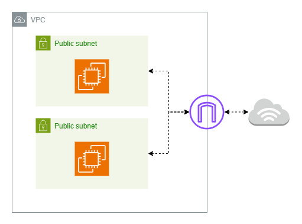

# Liebherr Case Study

Repository for the Liebherr case study. This repository contains a small Terraform project that provisions a VPC, two public subnets, a security group allowing SSH/HTTP, and two EC2 instances.

## Development environment setup

### Prerequisites:

- Terraform (v1.12.2)
- AWS CLI (2.28.11)
- AWS credentials configured (via `~/.aws/credentials` or environment variables `AWS_ACCESS_KEY_ID` and `AWS_SECRET_ACCESS_KEY`)
- An AWS S3 bucket for storing Terraform state files - referenced by the `bucket` variable in the [Terraform backend config file](./backend.config)
- An AWS key pair for SSH connection to EC2 instances - referenced by the `key_name` variable in the [Terraform variable file](./terraform.tfvars)

## How to deploy

### Adapt Terraform config and variable files

The repository uses AWS S3 for the Terraform state management and provides a [`backend.config`](./backend.config) file to setup.
Edit [`backend.config`](./backend.config) to set `bucket` and `key`, which define where the state file should be stored in AWS S3.
See [Terraform state management](#terraform-state-management) for more information.

Example [`backend.config`](./backend.config) values to set before `terraform init`:

```hcl
bucket = "your-backend-bucket-name"
key    = "your-terraform-state-file.tfstate"
region = "eu-central-1"
```

The repository also provides [`variables.tf`](./variables.tf) as default definition and a [`terraform.tfvars`](./terraform.tfvars) file for local values.
Edit [`terraform.tfvars`](./terraform.tfvars) to set `prefix` and `key_name` at minimum.
Other variables can be set as well based on user need.

Example [`terraform.tfvars`](./terraform.tfvars) values to set before `terraform apply`:

```hcl
prefix   = "your-project"
key_name = "your-ec2-keypair"
```

### Deploy Terraform templates

1. Initialize Terraform

```bash
terraform init -backend-config=backend.config
```

2. Inspect the planned changes:

```bash
terraform plan
```

3. Apply the plan:

```bash
terraform apply
```

### Clean up

When done, destroy resources to avoid charges:

```bash
terraform destroy
```

## Repository overview

This repository defines Terraform templates in [the root directory](./) and Terraform modules located under [the modules directory](./modules/).

Top-level files:

- `main.tf` contains the root module wiring submodules together.
- `variables.tf` defines variables used by the root module.
- `terraform.tfvars` provides variables values (local overrides).
- `backend.tf` defines Terraform backend configuration via AWS S3.
- `backend.config` provides bucket/key/region variables for Terraform backend configuration.
- `outputs.tf` defines outputs after `terraform apply`.
- `provider.tf` defines which plugin or dependency to install and use, in order to interact with services and cloud providers.
- `.terraform.lock.hcl` locks provider checksums and versions for reproducible runs.

Modules:

- `modules/vpc` defines the network infrastructure and creates one VPC with two public subnets.
- `modules/security_group` creates an AWS security group, allowing SSH and HTTP ingress.
- `modules/ec2` creates two EC2 instances in the two public subnets.

## Terraform state management

This Terraform project is designed to use a remote AWS S3 backend for state management to enable collaboration and locking.

The Terraform backend is defined in [the `backend.tf` file](./backend.tf) and uses [a `backend.config` file](./backend.config) to set configuration variables.

`use_lockfile` is set to `true` in `backend.tf` to write a lockfile in S3 that Terraform uses for concurrency control.

`encrypt` is set to `true` in `backend.tf` to enable S3 bucket encryption.
S3 state files often contain sensitive data.
Consider enabling server-side encryption and versioning for the S3 bucket.

## Deployment architecture

High-level architecture created by this Terraform project:

- One VPC with the CIDR configured via the variable `vpc_cidr` (by default `10.0.0.0/16`).

- Two public subnets configurable via the variable `public_subnet_cidrs`(by default `10.0.1.0/24` and `10.0.2.0/24`).

- An Internet Gateway attached to the VPC and a public route table with a default route to the IGW, associated with the public subnets.

- A security group that allows inbound SSH (22) and HTTP (80) from anywhere (0.0.0.0/0) and allows all outbound traffic.

- Two EC2 instances launched in the public subnets using the provided AMI (`ami_id`) and instance type (`instance_type`). Instances receive a public IP and use the security group for SSH/HTTP.



## Trade-offs and enhancements

- Currently `modules/ec2` creates one instance in each subnet. The `count` variable equals the number of public subnets. Consider exposing a variable like `instance_count` if it is required to decouple it from subnets.

- Currently there are only public subnets. Add private subnets and a NAT gateway for secure private instances.

- Add user-data or configuration management for instance provisioning.

- Add CI checks for `terraform fmt` and `terraform validate`.
